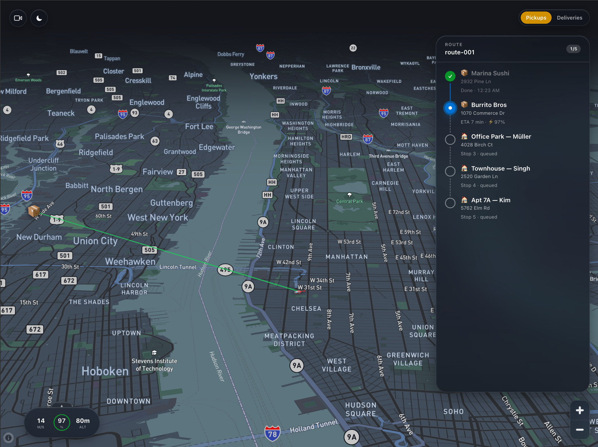

# Revelstreet — Drone Delivery Operator Interface

Tablet-first operator interface for drone-delivery runs. Operators manage multi-stop routes (restaurant pickups → residential deliveries) with real-time drone telemetry, map-first navigation, and offline-friendly progress tracking.



## Stack

- Vite 6 + React 19 + TypeScript (strict)
- Tailwind v4 (CSS-first config)
- TanStack Query + TanStack Router
- HeroUI v3 components
- Mapbox GL JS — full-screen map, 3D buildings, animated drone marker
- MSW for API mocking

## Quick start

```bash
pnpm install
pnpm dev
```

Open http://localhost:5173. For LAN tablet testing, use the network URL printed by `pnpm dev`.

## Project structure

```
src/
├── modules/<feature>/   # Feature-bounded; cross-module imports go through index.ts only
├── shared/              # Cross-cutting primitives (components, hooks, utils)
├── routes/              # TanStack Router configuration
└── mock/                # Mock data + MSW handlers
```

## Docs

All plans, research, and decisions live in [`docs/`](./docs).
